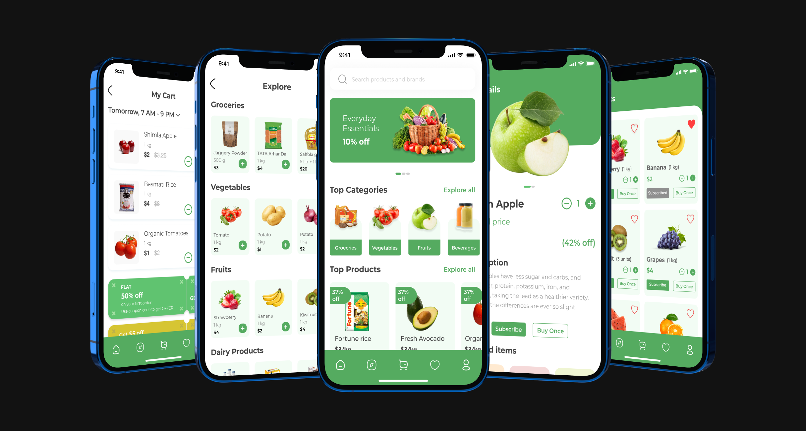

# FlutterEcommerceFirebase

<div>
<strong>

A Flutter Application, Built with ❤️ from [FlutterEcommerceFirebase](https://github.com/webaddicted/)

</strong>

<h4>This is a Grocery Application built with Flutter.

It uses [Firebase](https://console.firebase.google.com/u/0/?pli=1) to store and retrieve data.</h4>

</div>

## System Requirements

Dart SDK Version 2.17.0 or greater.

Flutter SDK Version 3.0.0 or greater.

## Figma Design
https://www.figma.com/file/MFmvrF4Lkjw0rCLzPmH1yk/Grocery

### Firebase Collections

1. Addresses
2. Users
3. Wishlists
4. Products
5. Categories
6. Cart

## Application Screens


## Application Features

1. SignUp and SignIn with Email and Password
2. SignUp and SignIn with Google
3. SignUp and SignIn with Facebook
4. Listing of Categories
5. Listing of Products
6. Product details
7. Add products to Cart
8. Add products to Wishlist
9. Add new Address and Show list of Addresses
10. Profile of the User
11. Static screens like privacy policy and terms of services.

## Third party packages Used
1. flutter_login_facebook
2. firebase_auth
3. google_sign_in
4. flutter_facebook_auth

## Run the application.

1. This app has firebase google/facebook and email - SignUp and SignIn. Thus, you need to add following files to run the application
- google-services.json
- facebook_app_id and token in strings.xml
- firebase_app_id_file.json for ios
- GoogleService-Info.plist for ios

2. Install flutterfire from [Here](https://firebase.flutter.dev/docs/cli/).

3. Use `flutterfire configure` to generate firebase_options.dart file.
- you can find these files in your firebase console and project setting.

4. You need to create one constants.dart inside lib/core/constants to store webflow token and CollectionIds to call the APIs.

5. ```Flutter pub get ```

6. ``` Flutter run ```


## Folder Structure

```
├── android - contains files and folders required for running the application on an Android operating system.
├── assets - contains all images and fonts of your application.
├── ios - contains files required by the application to run the dart code on iOS platforms.
├── lib - Most important folder in the project, used to write most of the dart code.
├── main.dart - starting point of the application
├── core
│ ├── app_export.dart - contains commonly used file imports
│ ├── constants - contains all constants classes
│ ├── errors - contains error handling classes
│ ├── network - contains network related classes
│ └── utils - contains common files and utilities of project
├── data
│ ├── apiClient - contains api calling methods
│ ├── models - contains request/response models
│ └── repository - network repository
├── localization - contains localization classes
├── presentation - contains all screens and screen controllers
│ └── screens - contains all screens
├── routes - contains all the routes of application
└── theme - contains app theme and decoration classes

```